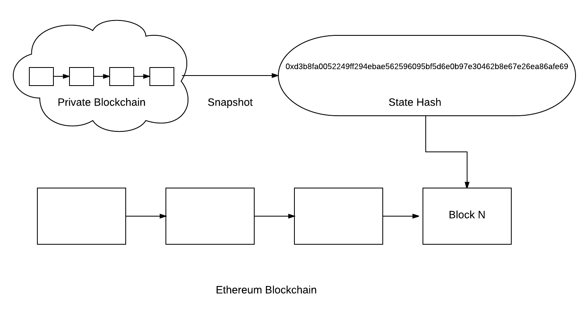

# blockchainer

A simple command line tool to checkpoint your blockchain's state on another blockchain.

Blockchainer takes your blockchain's state snapshot and imprints it on a higher level chain.

## State Snapshots

Any database or Ethereum-based blockchain can have its state snapshotted by taking a hash on the formatted data. In the case of Ethereum-based blockchains, this hash can be saved along with a block number and used to prove that a set of data is consistent with the current history of the blockchain.



This lends credibility to the private blockchain because its history can be proven to have existed at a certain point in time (enforced by the trust in the public Ethereum blockchain).

[Parity](https://github.com/paritytech/parity) creates state snapshots by default when your node syncs (snapshots taken by default every 30,000 blocks). It stores a hash and a block number corresponding to these snapshots in a `MANIFEST` file. For more information, see [this page](https://github.com/paritytech/parity/wiki/Warp-Sync-Snapshot-Format). Blockchainer references this `MANIFEST` and imprints the state hash and block number onto a higher level chain (usually public Ethereum, but configurable). As of now, Parity is the only client that takes state snapshots, so it is a requirement to run blockchainer. 


## Steps to configure

The following information needs to be captured in `config.json`:

1. Create a 12-24 BIP39 mnemonic phrase (generator [here](https://iancoleman.io/bip39/)) and save this as `MNEMONIC`
2. Determine your `GAS_PRICE` and `GAS_LIMIT` - I recommend `0x5F5E100` and `0x7A120`, respectively.
3. Find where Parity stores blockchain data on your machine (details [here](https://ethereum.stackexchange.com/questions/6471/where-are-my-keys-and-chain-data-located-if-i-am-using-parity)) and save this as `PARITY_DIR`. On mac, this should be `~/Library/Application\ Support/io.parity.ethereum/`
4. Determine the name of the chain you are using for Parity. For more information, see [this article](https://github.com/paritytech/parity/wiki/Chain-specification). Note that for testing, if you have a node running on the public net you can use `ethereum`.
4. Identify your gateway to the higher level network. For production, I recommend using [INFURA](https://infura.io). For local development, I recommend [Ganache](https://github.com/trufflesuite/ganache), which manifests itself as `http://localhost:7545`. Save this variable as `PUBLIC_HOST`.
5. Deploy the contract in `contracts/Checkpoint.sol` with `truffle migrate`. Get the address of this contract and save it as `CONTRACT`.

Your `config.json` file should look like this:

```
{
  "PUBLIC_HOST": "http://localhost:7545",
  "CONTRACT": "0xf12b5dd4ead5f743c6baa640b0216200e89b60da",
  "MNEMONIC": "candy maple cake sugar pudding cream honey rich smooth crumble sweet treat",
  "PARITY_DIR": "~/Library/Application Support/io.parity.ethereum",
  "CHAIN_NAME": "ethereum",
  "GAS_PRICE": "0x5F5E100",
  "GAS_LIMIT": "0x7A120"
}
```

## Running blockchainer

With the configuration set, you're ready to start blockchainer with the following command:

```
blockchainer run <interval> <chainId>
```

Where `<interval>` is the number of seconds between checkpoints and `<chainId>` can be anything you want. Typically this would be the identifier that goes along with your blockchain (each private chain will have its own `chainId`, which you can find in `web3.version.network`), but there are no restrictions so you can leave this as 0 if you want. For more information on `chainId`s, see [here](https://ethereum.stackexchange.com/questions/17207/how-to-detect-if-on-mainnet-or-testnet)).
